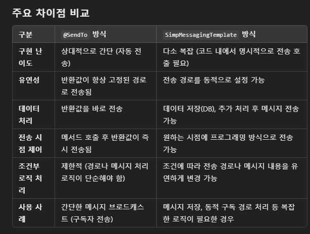

# 0124-이진호TIL

## 백엔드에서 채팅 메세지 전송 방식 비교



## 웹소켓 클라이언트 비교


## 실시간 채팅 구현

### 프론트 STOMP, SockJS, React 예제

- 코드
    - 전체 코드 App.js
        
        ```jsx
        import React, { useState, useRef } from "react";
        import { Client } from "@stomp/stompjs";
        import SockJS from "sockjs-client";
        
        const App = () => {
            const [userData, setUserData] = useState({
                username: "",
                connected: false,
                message: "",
                roomId: "public", // 기본 방 ID
            });
            const [messages, setMessages] = useState([]);
            const stompClientRef = useRef(null);
        
            const connect = () => {
                const sock = new SockJS("http://localhost:8080/ws"); // SockJS로 WebSocket 연결
                stompClientRef.current = new Client({
                    webSocketFactory: () => sock,
                    debug: (str) => console.log(str), // 디버그 로그 출력
                    reconnectDelay: 5000, // 자동 재연결 딜레이 설정
                });
        
                stompClientRef.current.onConnect = () => {
                    console.log("Connected to WebSocket");
                    setUserData((prevState) => ({
                        ...prevState,
                        connected: true,
                    }));
        
                    // 방 구독
                    stompClientRef.current.subscribe(`/topic/${userData.roomId}`, onMessageReceived);
        
                    // 사용자 추가 메시지 전송
                    stompClientRef.current.publish({
                        destination: `/app/chat.addUser/${userData.roomId}`,
                        body: JSON.stringify({ sender: userData.username, type: "JOIN" }),
                    });
                };
        
                stompClientRef.current.onStompError = (frame) => {
                    console.error("STOMP error:", frame);
                    alert("WebSocket 연결에 문제가 발생했습니다.");
                };
        
                stompClientRef.current.activate();
            };
        
            const onMessageReceived = (payload) => {
                const message = JSON.parse(payload.body);
                setMessages((prevMessages) => [...prevMessages, message]);
            };
        
            const handleSendMessage = () => {
                if (stompClientRef.current) {
                    const chatMessage = {
                        sender: userData.username,
                        content: userData.message,
                        type: "CHAT",
                    };
                    stompClientRef.current.publish({
                        destination: `/app/chat.sendMessage/${userData.roomId}`,
                        body: JSON.stringify(chatMessage),
                    });
                    setUserData({ ...userData, message: "" });
                }
            };
        
            return (
                <div>
                    {!userData.connected ? (
                        <div>
                            <h1>Join Chat</h1>
                            <input
                                type="text"
                                placeholder="Enter your name"
                                value={userData.username}
                                onChange={(e) =>
                                    setUserData({ ...userData, username: e.target.value })
                                }
                            />
                            <input
                                type="text"
                                placeholder="Enter Room ID (default: public)"
                                value={userData.roomId}
                                onChange={(e) =>
                                    setUserData({ ...userData, roomId: e.target.value })
                                }
                            />
                            <button onClick={connect}>Connect</button>
                        </div>
                    ) : (
                        <div>
                            <h1>Chat Room: {userData.roomId}</h1>
                            <div style={{ border: "1px solid #ccc", padding: "10px", height: "300px", overflowY: "scroll" }}>
                                {messages.map((msg, index) => (
                                    <div key={index}>
                                        <b>{msg.sender}</b>: {msg.content}
                                    </div>
                                ))}
                            </div>
                            <input
                                type="text"
                                placeholder="Type a message"
                                value={userData.message}
                                onChange={(e) =>
                                    setUserData({ ...userData, message: e.target.value })
                                }
                            />
                            <button onClick={handleSendMessage}>Send</button>
                        </div>
                    )}
                </div>
            );
        };
        
        export default App;
        
        ```
        
    - 연결함수 코드
        - 방구독 요청 /topic 경로로 보내고 방구독
        
        ```jsx
        const connect = () => {
                const sock = new SockJS("http://localhost:8080/ws"); // SockJS로 WebSocket 연결
                stompClientRef.current = new Client({
                    webSocketFactory: () => sock,
                    debug: (str) => console.log(str), // 디버그 로그 출력
                    reconnectDelay: 5000, // 자동 재연결 딜레이 설정
                });
        
                stompClientRef.current.onConnect = () => {
                    console.log("Connected to WebSocket");
                    setUserData((prevState) => ({
                        ...prevState,
                        connected: true,
                    }));
        
                    // 방 구독
                    stompClientRef.current.subscribe(`/topic/${userData.roomId}`, onMessageReceived);
        
                    // 사용자 추가 메시지 전송
                    stompClientRef.current.publish({
                        destination: `/app/chat.addUser/${userData.roomId}`,
                        body: JSON.stringify({ sender: userData.username, type: "JOIN" }),
                    });
                };
        
                stompClientRef.current.onStompError = (frame) => {
                    console.error("STOMP error:", frame);
                    alert("WebSocket 연결에 문제가 발생했습니다.");
                };
        
                stompClientRef.current.activate();
            };
        
            const onMessageReceived = (payload) => {
                const message = JSON.parse(payload.body);
                setMessages((prevMessages) => [...prevMessages, message]);
            };
        ```
        
    - 메세지 전송 코드
        - 메세지 전송 /app 경로로 메세지 전송
        
        ```jsx
        const handleSendMessage = () => {
                if (stompClientRef.current) {
                    const chatMessage = {
                        sender: userData.username,
                        content: userData.message,
                        type: "CHAT",
                    };
                    stompClientRef.current.publish({
                        destination: `/app/chat.sendMessage/${userData.roomId}`,
                        body: JSON.stringify(chatMessage),
                    });
                    setUserData({ ...userData, message: "" });
                }
            };
        ```
        
    - 메세지 수신 코드
        
        ```jsx
        const onMessageReceived = (payload) => {
                const message = JSON.parse(payload.body);
                setMessages((prevMessages) => [...prevMessages, message]);
            };
        ```
        

### 백엔드

- 코드
    - 브로커 설정 코드
        - /topic 경로로 구독함
        - 사용자가 /app 경로로 메세지를 보냄
        
        ```jsx
        package org.com.ssafy_poc.config;
        
        import org.springframework.context.annotation.Configuration;
        import org.springframework.messaging.simp.config.MessageBrokerRegistry;
        import org.springframework.web.socket.config.annotation.EnableWebSocketMessageBroker;
        import org.springframework.web.socket.config.annotation.StompEndpointRegistry;
        import org.springframework.web.socket.config.annotation.WebSocketMessageBrokerConfigurer;
        
        @Configuration
        @EnableWebSocketMessageBroker
        public class WebSocketBrokerConfig implements WebSocketMessageBrokerConfigurer {
        
        	@Override
        	public void configureMessageBroker(MessageBrokerRegistry config) {
        		// 클라이언트가 구독할 경로
        		config.enableSimpleBroker("/topic", "/queue");
        		// 클라이언트가 메시지를 보낼 경로
        		config.setApplicationDestinationPrefixes("/app");
        	}
        
        	@Override
        	public void registerStompEndpoints(StompEndpointRegistry registry) {
        		// WebSocket 연결 엔드포인트
        		registry.addEndpoint("/ws") // webSocket 엔드포인트 설정
        			.setAllowedOriginPatterns("http://localhost:3000") // 특정 도메인 허용
        			.withSockJS(); //SockJS 폴백 지원
        	}
        }
        
        ```
        
    - web 설정 코드
        
        ```jsx
        package org.com.ssafy_poc.config;
        
        import org.springframework.web.servlet.config.annotation.CorsRegistry;
        import org.springframework.web.servlet.config.annotation.WebMvcConfigurer;
        
        public class WebConfig implements WebMvcConfigurer {
        	private static final String DEVELOP_FRONT_ADDRESS = "http://localhost:3000";
        
        	@Override
        	public void addCorsMappings(CorsRegistry registry) {
        		registry.addMapping("/**")
        			.allowedOrigins("http://localhost:3000", "https://production-url.com") // 개발 및 배포 환경
        			.allowedMethods("GET", "POST", "PUT", "DELETE", "OPTIONS")
        			.allowedHeaders("*")
        			.allowCredentials(true);
        	}
        }
        
        ```
        
    - 예제 컨트롤러
        
        ```java
        package org.com.ssafy_poc.domain.chat.controller;
        
        import java.util.ArrayList;
        import java.util.List;
        import java.util.concurrent.ConcurrentHashMap;
        import java.util.concurrent.ConcurrentLinkedQueue;
        
        import org.com.ssafy_poc.domain.chat.dto.Message;
        import org.slf4j.Logger;
        import org.slf4j.LoggerFactory;
        import org.springframework.beans.factory.annotation.Autowired;
        import org.springframework.messaging.handler.annotation.DestinationVariable;
        import org.springframework.messaging.handler.annotation.MessageMapping;
        import org.springframework.messaging.handler.annotation.SendTo;
        import org.springframework.messaging.simp.SimpMessagingTemplate;
        import org.springframework.stereotype.Controller;
        import org.springframework.web.bind.annotation.GetMapping;
        import org.springframework.web.bind.annotation.PathVariable;
        
        @Controller
        public class ChatController {
        
        	private static final Logger logger = LoggerFactory.getLogger(ChatController.class);
        	private final ConcurrentHashMap<String, ConcurrentLinkedQueue<String>> roomMembers = new ConcurrentHashMap<>();
        
        	@Autowired
        	private SimpMessagingTemplate messagingTemplate;
        
        	// 클라이언트에서 /app/chat.addUser/{roomId} 요청 시 처리
        	@MessageMapping("/chat.addUser/{roomId}")
        	@SendTo("/topic/{roomId}")
        	public Message addUser(@DestinationVariable String roomId, Message message) {
        		roomMembers.computeIfAbsent(roomId, k -> new ConcurrentLinkedQueue<>()).add(message.getSender());
        		message.setContent(message.getSender() + " joined room " + roomId + ".");
        		logger.info("User {} joined room {}", message.getSender(), roomId);
        		return message;
        	}
        
        	// 클라이언트에서 /app/chat.sendMessage/{roomId} 요청 시 처리
        	// 로직 처리 없이 그냥 무조건 메세지 반환
        	@MessageMapping("/chat.sendMessage/{roomId}")
        	@SendTo("/topic/{roomId}")
        	public Message sendMessage(@DestinationVariable String roomId, Message message) {
        		logger.info("User {} sent message to room {}: {}", message.getSender(), roomId, message.getContent());
        		return message;
        	}
        
        	// 특정 로직처리가 필요한 경우
        	// @MessageMapping("/chat.sendMessage/{roomId}")
        	// public void sendMessage(@DestinationVariable String roomId, Message message) {
        	// 	if (message.getSender().equals("banned_user")) {
        	// 		logger.warn("Blocked user {} tried to send a message", message.getSender());
        	// 		return; // 메시지 전송 차단
        	// 	}
        	//
        	// 	if (roomId.equals("admin_room")) {
        	// 		// 특정 방에 추가 메시지를 전송
        	// 		messagingTemplate.convertAndSend("/topic/admin_notifications", message);
        	// 	}
        	//
        	// 	// 기본 방으로 메시지 전송
        	// 	messagingTemplate.convertAndSend("/topic/" + roomId, message);
        	// }
        
        	// REST API로 방 멤버 조회
        	@GetMapping("/rooms/{roomId}/members")
        	public List<String> getRoomMembers(@PathVariable String roomId) {
        		return new ArrayList<>(roomMembers.getOrDefault(roomId, new ConcurrentLinkedQueue<>()));
        	}
        
        }
        
        ```
        
- @SendTo 어노테이션 방식
    - 문제점
    
    
    
- 예제코드 레디스로 변경할때
    - 코드
        
        ```java
        import org.com.ssafy_poc.domain.chat.dto.Message;
        import org.slf4j.Logger;
        import org.slf4j.LoggerFactory;
        import org.springframework.beans.factory.annotation.Autowired;
        import org.springframework.data.redis.core.StringRedisTemplate;
        import org.springframework.data.redis.core.SetOperations;
        import org.springframework.messaging.handler.annotation.DestinationVariable;
        import org.springframework.messaging.handler.annotation.MessageMapping;
        import org.springframework.messaging.handler.annotation.SendTo;
        import org.springframework.stereotype.Controller;
        import org.springframework.web.bind.annotation.GetMapping;
        import org.springframework.web.bind.annotation.PathVariable;
        
        import java.util.Set;
        
        @Controller
        public class ChatController {
            private static final Logger logger = LoggerFactory.getLogger(ChatController.class);
        
            private final SetOperations<String, String> setOperations;
        
            @Autowired
            public ChatController(StringRedisTemplate redisTemplate) {
                this.setOperations = redisTemplate.opsForSet();
            }
        
            // 클라이언트에서 /app/chat.addUser/{roomId} 요청 시 처리
            @MessageMapping("/chat.addUser/{roomId}")
            @SendTo("/topic/{roomId}")
            public Message addUser(@DestinationVariable String roomId, Message message) {
                String key = "room:" + roomId; // Redis 키 형식: room:{roomId}
                setOperations.add(key, message.getSender()); // 사용자 추가
                message.setContent(message.getSender() + " joined room " + roomId + ".");
                logger.info("User {} joined room {}", message.getSender(), roomId);
                return message;
            }
        
            // 클라이언트에서 /app/chat.sendMessage/{roomId} 요청 시 처리
            @MessageMapping("/chat.sendMessage/{roomId}")
            @SendTo("/topic/{roomId}")
            public Message sendMessage(@DestinationVariable String roomId, Message message) {
                logger.info("User {} sent message to room {}: {}", message.getSender(), roomId, message.getContent());
                return message;
            }
        
            // REST API로 방 멤버 조회
            @GetMapping("/rooms/{roomId}/members")
            public Set<String> getRoomMembers(@PathVariable String roomId) {
                String key = "room:" + roomId;
                return setOperations.members(key); // Redis에서 방 멤버 조회
            }
        }
        
        ```
        
- 폴백이란
    
    ---
    
    ### **폴백의 정의**
    
    폴백은 특정 기능이나 서비스가 실패하거나 사용할 수 없을 때 **대체 경로나 기능**을 제공하여 **시스템이 계속 동작하도록 보장**하는 것입니다.
    
    ### **예시**:
    
    - WebSocket 통신이 불가능한 경우, Long Polling이나 HTTP 요청으로 대체.
    - 데이터베이스 서버가 다운되었을 때, 백업 데이터베이스로 전환.
    - 서비스가 장애를 겪을 경우, 사용자에게 "서비스 중지" 메시지를 표시하는 대신 대체 콘텐츠 제공.
    
    ---
    
    ### **폴백이 자주 사용되는 예**
    
    1. **WebSocket 통신**:
        - WebSocket 연결 실패 시 HTTP 기반 통신으로 폴백.
        - 예: `SockJS` 라이브러리.
    2. **클라우드 서비스**:
        - 한 지역의 데이터센터가 중단되면 다른 지역으로 요청 전환.
    3. **브라우저 호환성**:
        - 구형 브라우저에서 최신 기능을 지원하지 않으면 폴백 제공.
        - 예: HTML5 `video` 태그 폴백 → Flash 플레이어로 대체.
    4. **데이터 저장**:
        - 주 데이터베이스가 다운되면 파일 시스템 또는 다른 DB로 폴백.
    
    ---
    
    **SockJS**는 기본적으로 WebSocket을 최우선으로 사용하려 시도하지만, WebSocket이 실패하거나 지원되지 않는 환경에서는 **자동으로 폴백(fallback)**을 제공합니다. SockJS는 사용자가 직접 폴백 방식을 설정하지 않아도, 브라우저 및 네트워크 상태에 따라 **내장된 폴백 메커니즘**을 사용하여 적절한 대체 방식을 선택합니다.
    
    ---
    
    ### **1. SockJS의 폴백 메커니즘**
    
    SockJS는 WebSocket 연결이 실패할 경우 다음 폴백 방식을 자동으로 사용합니다:
    
    1. **XHR Streaming**:
        - 서버는 HTTP 요청을 통해 데이터를 지속적으로 전송.
        - WebSocket과 비슷하게 작동하지만 HTTP 기반.
    2. **XHR Polling (Long Polling)**:
        - 클라이언트가 주기적으로 HTTP 요청을 보내 서버에서 데이터를 가져옴.
        - HTTP 요청과 응답이 짝을 이루며, WebSocket보다 지연이 큼.
    3. **Iframe-based Transport** (구형 브라우저):
        - iframe과 HTML 파일을 이용하여 서버-클라이언트 간 통신.
    
    SockJS는 사용 가능한 **최적의 전송 방식**을 자동으로 선택합니다.
    
    ---
    
    ### 프론트 폴백 설정
    
    ```java
    import SockJS from 'sockjs-client';
    
    // SockJS 인스턴스 생성
    const sock = new SockJS('http://localhost:8080/ws');
    
    // 연결 이벤트
    sock.onopen = () => {
        console.log('Connection opened:', sock.protocol); // 현재 사용하는 전송 방식 출력
    };
    
    // 메시지 수신 이벤트
    sock.onmessage = (e) => {
        console.log('Message received:', e.data);
    };
    
    // 연결 닫힘 이벤트
    sock.onclose = () => {
        console.log('Connection closed');
    };
    
    // 메시지 전송
    sock.send('Hello Server!');
    ```
    

## 비밀번호 찾기 이메일 전송

### 프론트

- 코드
    - 테스트 코드
        
        ```jsx
        import React, { useState } from "react";
        
        const ForgotPassword = () => {
          const [email, setEmail] = useState(""); // 사용자가 입력한 이메일 저장
          const [message, setMessage] = useState(""); // 상태 메시지 저장
          const [showVerification, setShowVerification] = useState(false); // 인증번호 입력 창 표시 여부
        
          // 이메일 전송 요청
          const handleSendEmail = async () => {
            try {
              const response = await fetch("/sendMail", {
                method: "POST",
                headers: { "Content-Type": "application/x-www-form-urlencoded" },
                body: new URLSearchParams({ email }), // FormData 형식으로 이메일 전송
              });
        
              if (response.ok) {
                setMessage("Verification code sent to your email."); // 성공 메시지
                setShowVerification(true); // 인증번호 입력 창 표시
              } else {
                const data = await response.json();
                setMessage(data.error || "Failed to send email."); // 실패 메시지
              }
            } catch (error) {
              setMessage("An error occurred. Please try again later."); // 에러 처리
            }
          };
        
          return (
            <div>
              <h2>Forgot Password</h2>
              <input
                type="email"
                placeholder="Enter your email" // 이메일 입력 필드
                value={email}
                onChange={(e) => setEmail(e.target.value)}
              />
              <button onClick={handleSendEmail}>Send Verification Code</button>
              {message && <p>{message}</p>} {/* 상태 메시지 출력 */}
              {showVerification && <Verification email={email} />} {/* 인증번호 입력 창 */}
            </div>
          );
        };
        
        const Verification = ({ email }) => {
          const [code, setCode] = useState(""); // 입력한 인증번호 저장
          const [message, setMessage] = useState(""); // 상태 메시지 저장
          const [verified, setVerified] = useState(false); // 인증 여부 상태
        
          // 인증번호 검증 요청
          const handleVerifyCode = async () => {
            try {
              const response = await fetch("/checkMail", {
                method: "POST",
                headers: { "Content-Type": "application/x-www-form-urlencoded" },
                body: new URLSearchParams({ email, insertKey: code }), // 이메일과 인증번호 전송
              });
        
              if (response.ok) {
                setMessage("Code verified. You can reset your password now."); // 성공 메시지
                setVerified(true); // 인증 성공 상태
              } else {
                const data = await response.json();
                setMessage(data.error || "Invalid verification code."); // 실패 메시지
              }
            } catch (error) {
              setMessage("An error occurred. Please try again later."); // 에러 처리
            }
          };
        
          return (
            <div>
              <h2>Verification</h2>
              <input
                type="text"
                placeholder="Enter verification code" // 인증번호 입력 필드
                value={code}
                onChange={(e) => setCode(e.target.value)}
              />
              <button onClick={handleVerifyCode}>Verify Code</button>
              {message && <p>{message}</p>} {/* 상태 메시지 출력 */}
              {verified && <ResetPassword email={email} />} {/* 비밀번호 재설정 창 */}
            </div>
          );
        };
        
        const ResetPassword = ({ email }) => {
          const [password, setPassword] = useState(""); // 입력한 새 비밀번호 저장
          const [message, setMessage] = useState(""); // 상태 메시지 저장
        
          // 비밀번호 재설정 요청
          const handleResetPassword = async () => {
            try {
              const response = await fetch("/api/auth/reset-password", {
                method: "POST",
                headers: { "Content-Type": "application/json" },
                body: JSON.stringify({ email, password }), // 이메일과 새 비밀번호 전송
              });
        
              if (response.ok) {
                setMessage("Password reset successfully."); // 성공 메시지
              } else {
                const data = await response.json();
                setMessage(data.error || "Failed to reset password."); // 실패 메시지
              }
            } catch (error) {
              setMessage("An error occurred. Please try again later."); // 에러 처리
            }
          };
        
          return (
            <div>
              <h2>Reset Password</h2>
              <input
                type="password"
                placeholder="Enter new password" // 새 비밀번호 입력 필드
                value={password}
                onChange={(e) => setPassword(e.target.value)}
              />
              <button onClick={handleResetPassword}>Reset Password</button>
              {message && <p>{message}</p>} {/* 상태 메시지 출력 */}
            </div>
          );
        };
        
        export default ForgotPassword;
        
        ```
        

### 백엔드

- 코드
    - 컨트롤러
        
        ```java
        package org.com.ssafy_poc.domain.email.controller;
        
        import java.util.Map;
        import java.util.UUID;
        import java.util.concurrent.ConcurrentHashMap;
        import org.com.ssafy_poc.domain.email.util.MailManager;
        import org.com.ssafy_poc.domain.email.util.SHA256Util;
        import org.springframework.stereotype.Controller;
        import org.springframework.web.bind.annotation.PostMapping;
        import org.springframework.web.bind.annotation.RequestBody;
        import org.springframework.web.bind.annotation.ResponseBody;
        
        import lombok.RequiredArgsConstructor;
        
        @Controller
        @RequiredArgsConstructor
        public class EmailController {
        
        	private final MailManager mailManager;
        	private final ConcurrentHashMap<String, String> emailAuthMap;
        
        	// 이메일 인증번호 전송
        	@PostMapping("/sendMail")
        	@ResponseBody
        	public String sendMail(@RequestBody Map<String, String> request) throws Exception {
        
        		String email = request.get("email");
        
        		if (email == null || email.isEmpty()) {
        			throw new IllegalArgumentException("Email is required");
        		}
        		// 랜덤한 UUID 생성 후 인증번호로 사용
        		UUID uuid = UUID.randomUUID();
        		String key = uuid.toString().substring(0, 7); // 인증번호: UUID에서 7자리 사용
        		String subject = "인증번호 입력을 위한 메일 전송";
        		String content = "인증 번호: " + key;
        
        		// 이메일 전송
        		mailManager.send(email, subject, content);
        
        		// 이메일에 기반하여 인증번호를 암호화한 값 저장
        		String encryptedKey = SHA256Util.getEncrypt(key, email);
        		emailAuthMap.put(email, encryptedKey); // ConcurrentHashMap에 저장
        		return "메일이 전송되었습니다.";
        	}
        
        	// 이메일 인증번호 확인
        	@PostMapping("/checkMail")
        	@ResponseBody
        	public boolean checkMail(@RequestBody Map<String, String> request) throws Exception {
        
        		String email = request.get("email");
        		if (email == null || email.isEmpty()) {
        			throw new IllegalArgumentException("Email is required");
        		}
        		String Authpassword = request.get("Authpassword");
        
        		if (email == null || email.isEmpty()) {
        			throw new IllegalArgumentException("password is required");
        		}
        
        		// 저장된 인증번호 가져오기
        		String storedKey = emailAuthMap.get(email);
        		if (storedKey == null) {
        			return false; // 인증번호가 존재하지 않음
        		}
        
        		// 입력된 인증번호를 암호화하여 비교
        		String encryptedInsertKey = SHA256Util.getEncrypt(Authpassword, email);
        
        		if (storedKey.equals(encryptedInsertKey)) {
        			// 인증 성공 시, 맵에서 해당 이메일 삭제
        			emailAuthMap.remove(email);
        			return true;
        		}
        
        		// 인증 실패
        		return false;
        	}
        }
        
        ```
        
    - 암호화 유틸
        
        ```java
        package org.com.ssafy_poc.domain.email.util;
        
        import java.security.MessageDigest;
        import java.security.NoSuchAlgorithmException;
        import java.util.Random;
        
        public class SHA256Util {
        	/**
        	 * SHA-256 암호화 함
        	 * @param source 원본
        	 * @param salt(String) SALT 값
        	 * @return
        	 */
        	public static String getEncrypt(String source, String salt) {
        		return getEncrypt(source, salt.getBytes());
        	}
        
        	/**
        	 * SHA-256 암호화 함
        	 * @param source 원본
        	 * @param salt(byte[]) SALT 값
        	 * @return
        	 */
        	public static String getEncrypt(String source, byte[] salt) {
        
        		String result = "";
        
        		byte[] a = source.getBytes();
        		byte[] bytes = new byte[a.length + salt.length];
        
        		System.arraycopy(a, 0, bytes, 0, a.length);
        		System.arraycopy(salt, 0, bytes, a.length, salt.length);
        
        		try {
        			// 암호화 방식 지정 메소드
        			MessageDigest md = MessageDigest.getInstance("SHA-256");
        			md.update(bytes);
        
        			byte[] byteData = md.digest();
        
        			StringBuffer sb = new StringBuffer();
        			for (int i = 0; i < byteData.length; i++) {
        				sb.append(Integer.toString((byteData[i] & 0xFF) + 256, 16).substring(1));
        			}
        
        			result = sb.toString();
        		} catch (NoSuchAlgorithmException e) {
        			e.printStackTrace();
        		}
        
        		return result;
        	}
        
        	/**
        	 * SALT를 얻어온다.
        	 * @return
        	 */
        	public static String generateSalt() {
        		Random random = new Random();
        
        		byte[] salt = new byte[8];
        		random.nextBytes(salt);
        
        		StringBuffer sb = new StringBuffer();
        		for (int i = 0; i < salt.length; i++) {
        			// byte 값을 Hex 값으로 바꾸기.
        			sb.append(String.format("%02x",salt[i]));
        		}
        
        		return sb.toString();
        	}
        }
        
        ```
        
    - 메일 매니저
        
        ```java
        package org.com.ssafy_poc.domain.email.util;
        
        import org.springframework.beans.factory.annotation.Autowired;
        import org.springframework.beans.factory.annotation.Value;
        import org.springframework.mail.javamail.JavaMailSender;
        import org.springframework.stereotype.Component;
        
        import jakarta.mail.internet.InternetAddress;
        import jakarta.mail.internet.MimeMessage;
        
        @Component
        public class MailManager {
        	@Value("${spring.mail.username}")
        	private String sender;
        
        	@Autowired
        	private JavaMailSender javaMailSender;
        
        	public void send(String sendTo, String sub, String con) throws Exception {
        		//		HTML 태그 그대로 전송하는 방법
        		MimeMessage mimeMessage = javaMailSender.createMimeMessage();
        		mimeMessage.setFrom(sender);
        		//받는사람
        		mimeMessage.addRecipient(MimeMessage.RecipientType.TO, new InternetAddress(sendTo));
        		mimeMessage.setSubject(sub);
        		mimeMessage.setText(con);
        		javaMailSender.send(mimeMessage);
        	}
        }
        
        ```
        
- 앱 설정파일
    - 앱비밀번호 = 구글 계정관리 ⇒ 위 검색창 앱비밀번호(2차 보안 필요)
    
    ```jsx
    spring.application.name=ssafy_poc
    
    spring.mail.host=smtp.gmail.com
    spring.mail.port=587
    spring.mail.username=구글 이메일
    spring.mail.password=앱비밀번호
    spring.mail.properties.mail.smtp.auth=true
    spring.mail.properties.mail.smtp.starttls.enable=true
    spring.mail.transport.protocol=smtp
    spring.mail.debug=true
    spring.mail.default.encoding=UTF-8
    ```