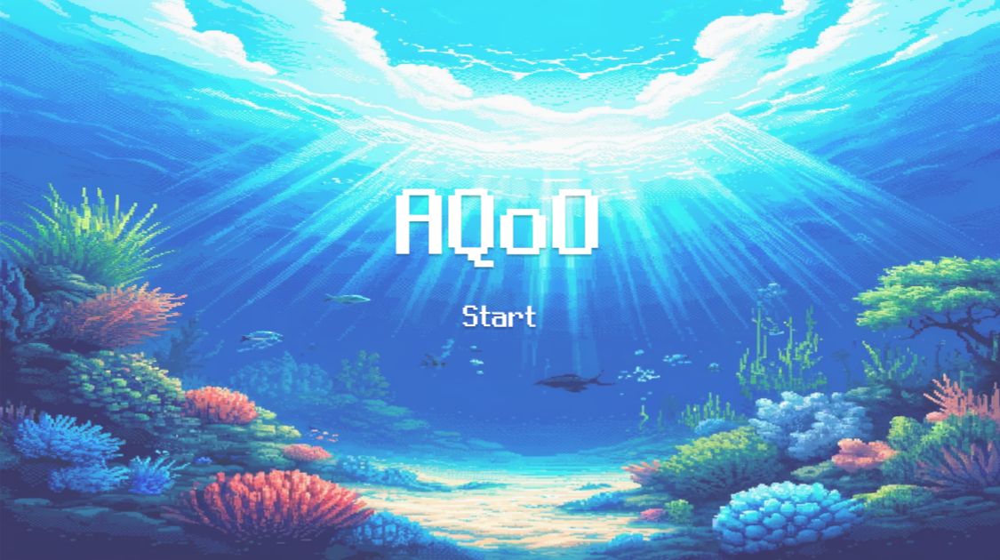

# 01/22

# DB 설계 마무리

# 기술 스택 선정

- 배포 및 운영 인프라 기술스택 선정 (회의 후 확정된 것만)

## 1. 인프라: AWS EC2

1. **선정 이유**
    - **소규모 트래픽**을 감당하기에 충분하고, 초기 설정이 비교적 단순
    - 실무에서도 많이 사용되는 클라우드 서비스로서 경험 축적에 유리
    - SSH를 통해 직접 접근 가능하고, Jenkins나 Docker Compose 등 필요한 도구들을 유연하게 설치 가능
2. **고려해야 할 점**
    - EC2 인스턴스 타입 선택(트래픽이 많지 않을 것으로 예상되므로 소형~중형 정도로 시작)
    - VPC, 서브넷, 보안 그룹 등의 네트워킹 설정: 최소한 SSH(22), HTTP(80) 정도만 열어두고 관리
    - 로그인 보안: Key Pair 관리, 필요시 IAM Roles 활용

---

## 2. 아키텍처: Docker Compose

1. **선정 이유**
    - **개발/운영 환경 일치**: Docker를 통해 의존성 문제가 줄어들고, 팀원 간 환경 통일이 쉬움
    - **간단한 멀티 컨테이너 구성**: DB, 백엔드(Spring Boot), 프론트(React) 등이 각각 컨테이너로 분리 가능
    - 쿠버네티스(Kubernetes)나 ECS보다 **설정이 간단**하여 소규모 프로젝트에 적합
2. **고려해야 할 점**
    - **docker-compose.yml**에 각 서비스(백엔드, DB, 프론트 등)의 빌드/이미지/포트 매핑 등을 명확하게 정의
    - (필요 시) 볼륨(Volume) 설정을 통해 DB 데이터 영구 보관(Production 환경에선 RDS도 고려 가능)
    - 네트워크 설정: 컨테이너 간 네트워크 연결 시 내부 포트 충돌 유의

---

## 3. CI/CD: Jenkins

1. **선정 이유**
    - **오픈소스 CI/CD의 대표 주자**: 플러그인 생태계가 풍부하고, 실무에서도 여전히 많이 사용
    - **커스터마이징 자유도**가 높고, 다양한 SCM, 빌드 도구, 배포 전략과 연동 쉬움
    - 자체 서버(EC2)에 설치해 독립적으로 운영 가능 → 내부 네트워크에서 배포 수행
2. **고려해야 할 점**
    - **Jenkins 설치 및 구성**:
        - EC2 서버에 Jenkins 설치 시 Java 버전, 포트, 접근 권한(보안) 등을 설정
        - 관리 콘솔(웹 UI)에서 플러그인(Jenkins Docker plugin, Git plugin, etc.) 설치
    - **Pipeline 설계**:
        - SCM Polling or Webhook을 통해 코드 변경 감지 → 빌드 → Docker 이미지 생성 → docker-compose 배포 or 재시작
        - 단계별(빌드, 테스트, 배포)로 파이프라인을 나누고, 실패 시 알림(이메일, Slack 등)
    - **무중단 배포**(선택 사항): docker-compose를 이용한 롤링 업데이트 or 컨테이너 교체 전략 설계 가능

---

## 4. 보안: HTTPS (시간 남을 시 적용)

1. **선정 이유**
    - 웹 서비스 기본 보안: 사용자 데이터 보호(인증 정보, 개인정보 등)
    - 실제 도메인(예: mygame.com)과 연결 시, TLS 인증서 적용으로 신뢰도 상승
2. **고려해야 할 점**
    - **무료 인증서**: Let’s Encrypt 사용 가능 (Certbot + Nginx 등), 자동 갱신 설정 필요
    - **AWS ELB + ACM**: EC2 앞단에 ALB(Application Load Balancer)를 두고 HTTPS 적용 (AWS Certificate Manager로 인증서 관리)
    - **도메인 연결**: Route 53 등 DNS 설정, CNAME/A 레코드 설정

# 로고 정하기

- 기본 로고 하면 될 거 같은데?

# 느낀점

6명 다 같이 피그마, API 명세서를 보면서 최종적으로 DB 설계와 API 설계를 마쳤다. (확정은 아니고 개발하면서 수정해 나갈 듯)

백엔드끼리 기본적인 API와 DB를 만들어봤지만 프론트와 소통하면서 더 디테일하게 접근해야 할 것, 추가적으로 필요한 요소 등을 새롭게 고려할 수 있었다.

위 수정로그는 최초로 DB를 설계한 뒤 백엔드끼리 회의하면서 바뀐 것, 프론트와 회의하면서 바뀐 것들을 알 수 있다. 특히 프론트와의 소통과정이 필요하다고 느낀 것이 맨 마지막 로그에 main_aquarium_id 같은 경우는 사용자의 대표 어항을 설정하는 것에 대해 백엔드에서 놓치고 있었는데 프론트에서 화면 설계를 하면서 필요한 부분이라 언급해주어서 추가된 내용이다.
이외에도 water_condition, pollution_status 필드를 삭제시킨 것도 프론트에서 이 필드에 대해 질문이 나왔고 백에서 이 필드에 대해 이야기를 나누면서 꼭 이 필드가 없어도 백에서 로직적으로 처리할 수 있다고 판단하여 삭제하기로 결정된 것이다.(마지막 먹이 준 시간, 마지막 청소한 시간, 마지막 물 갈아준 시간 등으로 계산 가능하다 판단)
이처럼 고려하다보면 백엔드에서 로직적으로 처리할 수 있는 부분이 있고 이런 것은 DB에 접근하도록 하지 않고 서비스단에서 로직적으로 처리하는 것이 성능적이나 보안적으로 낫다는 것을 다시 한 번 생각할 수 있었고 계속해서 고민해야겠다 느꼈다.