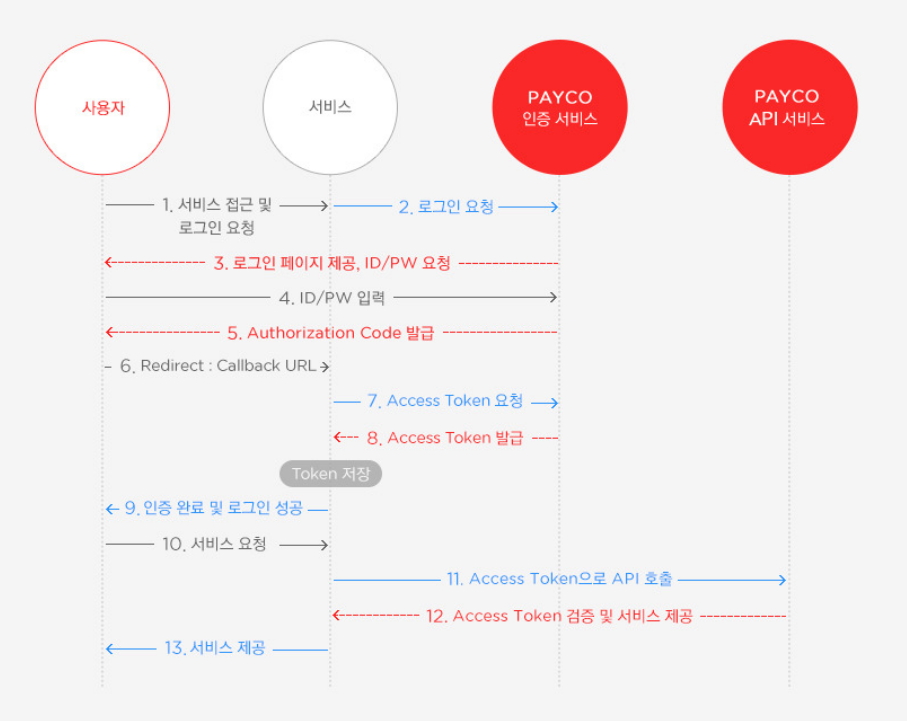

# 01/23

# OAuth 관련 공부 및 테스트 구현(PoC)

### 1. OAuth(Open Authorization)란?

인터넷 사용자들이 비밀번호를 제공하지 않고 다른 웹 사이트 상의 자신들의 정보에 대해 웹 사이트나 애플리케이션의 접근 권한을 부여할 수 있는 공통적인 수단으로서 사용되는 접근 위임을 위한 개방형 표준

→ 사용자가 해당 애플리케이션에 ID, PW 정보를 제공하지 않고, **신뢰할 수 있는 외부 애플리케이션의 OpenAPI에 ID, PW를 입력하여 해당 애플리케이션이 인증 과정을 처리**해주는 방식

### 2. OAtuh 가 없을 때의 문제점

1. 사용자 : A 사이트에 네이버의 ID와 PW를 넘겨주는 것을 신뢰할 수 없음
2. A : 네이버의 ID와 PW를 저장하기 때문에 보안 문제가 생길 경우 모든 책임을 져야 함.
3. 네이버 : A를 신뢰할 수 없음.

### 3. OAuth 2.0 구성 요소(용어)

- Resource Server
    
    OAuth2.0 서비스를 제공하고 Resource를 관리하는 서버 (구글, 네이버, 카카오 등)
    
    클라이언트에서는 Resource Server로 Token(인증 서버에서 발급 받은)을 넘겨 개인 정보를 받을 수 있음.
    
- Resource Owner (사용자)
    
    애플리케이션을 이용하려는 Resource Server의 계정을 소유하고 있는 사용자
    
- Client (클라이언트)
    
    Resource Server의 API를 이용하여 정보를 가져오려고 시도하는 애플리케이션 서버
    
- Authorization Server (인증 서버)
    
    클라이언트가 Resource Server의 서비스를 사용할 수 있게 인증하고, 토큰을 발행해주는 인증 서버 (구글, 네이버, 카카오의 인증 서버)
    
    사용자 → 이 인증 서버로 ID, PW를 넘겨 Authorization Code를 발급 받음
    
    클라이언트 → 사용자가 발급 받은 Authorization Code를 이 인증 서버로 넘겨 Token을 발급 받음
    
- Access Token
    
    JWT의 Access Token.
    
    해당 토큰으로 Resource Server에 요청해서 개인 정보를 받을 수 있음.
    
- Refresh Token
    
    JWT의 Refresh Token.
    
    해당 토큰으로 Access Token을 재발급 받을 수 있음.
    

### 4. 개략적인 흐름



### 5. 나만의 언어로 OAuth 흐름 정리

1. 사용자가 로그인하기 버튼 클릭
2. 로그인 페이지 이동(소셜 로그인 버튼들, 우리 서비스 로그인 버튼 선택 가능)
3. 소셜 로그인 버튼을 누르면 소셜 로그인 화면으로 이동(여기서는 예시로 네이버)
    - 이때 네이버는 어떤 서비스에서 요청이 왔는지 식별해야 하므로 우리 서비스의 id를 파라미터로 받음(Spring Security에서 알아서 파라미터로 달아줌)
    (Client id 외에도 scope와 state정보도 담아서 보내줌)
    state는 CSRF 충돌을 방지하기 위한? 그런 걸로 알고 있음
4. 클라이언트 id가 올바르면 네이버에서는 로그인 화면을 띄워줌.
5. 사용자는 네이버의 ID와 PW를 적어서 로그인 버튼 클릭
6. 네이버에서 자신의 DB를 조회하여 네이버 회원이 맞으면 임시 인증 코드(Authorization Code)를 uri에 담어서 사용자에게 리다이렉트 해줌.
7. 사용자는 리다이렉트된 uri을 다시 서버에 전송함.
8. 서버(백)의 controller에서 이 리다이렉트 되는 것을 메서드로 만들어 임시 인증 코드를 얻음.
9. 이렇게 얻은 임시 인증 코드와, client id, client secret, state, 리다이렉트된 uri를 담아 네이버에 AccessToken을 달라는요청을 보냄
10. 네이버는 파라미터에 담긴 정보들을 조회하여 올바른 접근이 확인되면 AccessToken을 응답해줌.
11. 서버에서 이 AccessToken을 활용하여 네이버에서 갖고 있는 API를 요청할 수 있음(이름, 성별, 이메일 등 사용자가 동의한 항목에 대해 요청을 보낼 수 있음)
    
    요청 보낼 때는 헤더에 “Bearer + AccessToken” 형식으로 담아줌
    

### 6. PoC 과정 중 생겼던 문제점과 해결 방법

전체적인 OAuth의 흐름은 이해했고, 소셜 로그인 시 올바르게 리다이렉트 되는 것을 확인함.

하지만 이 리다이렉트된 경로와 컨트롤러에 매핑된 경로가 분명히 일치하는데도 불구하고 컨트롤러가 호출되지 않는 상황이 계속됨.(sout으로 로그 찍어봤는데 계속 안 나옴)

여기저기 물어보고 gpt에게 물어보고 하다가 결국 Spring Security에서 OAuth2.0의 기본 설정 기능 때문에 기본 uri(예를 들어 `/login/oauth2/code/naver`)는 자동으로 가로채서 처리하고 있다는 것을 알게 되었음.

Spring Security에서 기본으로 처리하는 경로를 바꿔주면 내가 컨트롤러에 설정해놓은 경로를 자동으로 가로채는 상황을 없애주니 컨트롤러에서 호출이 일어나게 됨.

```java
.authorizationEndpoint(authorization -> authorization
                                .baseUri("/custom-oauth2/authorization") // OAuth2 기본 경로를 사용자 정의 경로로 변경
                        )
```

위와 같이 바꾸니 정상적으로 컨트롤러 호출이 일어남.

이 이후로는 일반적인 서비스와 컨트롤러를 다루는 방식으로 처리했더니 금방 구현하였음.

Spring Security → Controller 순서로 uri를 확인하여 처리함.

### 7. 느낀점

이전 관통 프로젝트도 그렇고 주변에서 애먹는 것들도 그렇고 대부분 Spring Security에서 문제가 발생하는 경우가 많았다.

이렇게 문제가 많은 이유가 Spring Security는 깐깐하게 조건이 걸려있기 때문이고(보안 문제가 발생하지 않도록) 개발하는 사람은 이 보안 조건을 필요한 만큼만 열어서 사용해야 하기 때문인 것 같다.

앞으로 프로젝트를 하든 개발을 하든 하면서 Spring Security를 정확하게 알고 올바르게 사용해야 오류에 애먹는 상황이 없을 것이라는 생각이 들었다.