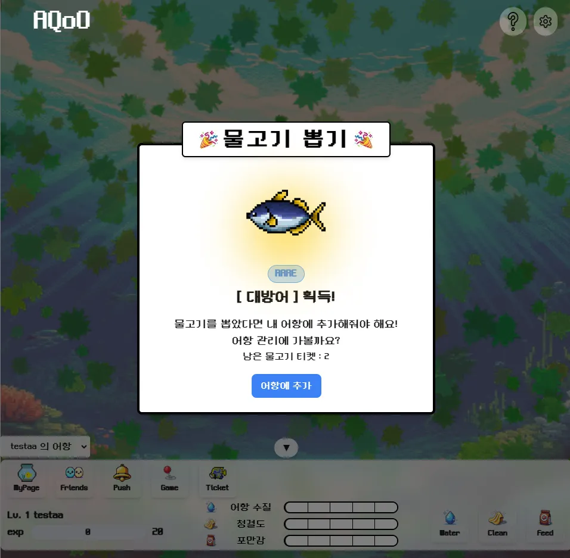
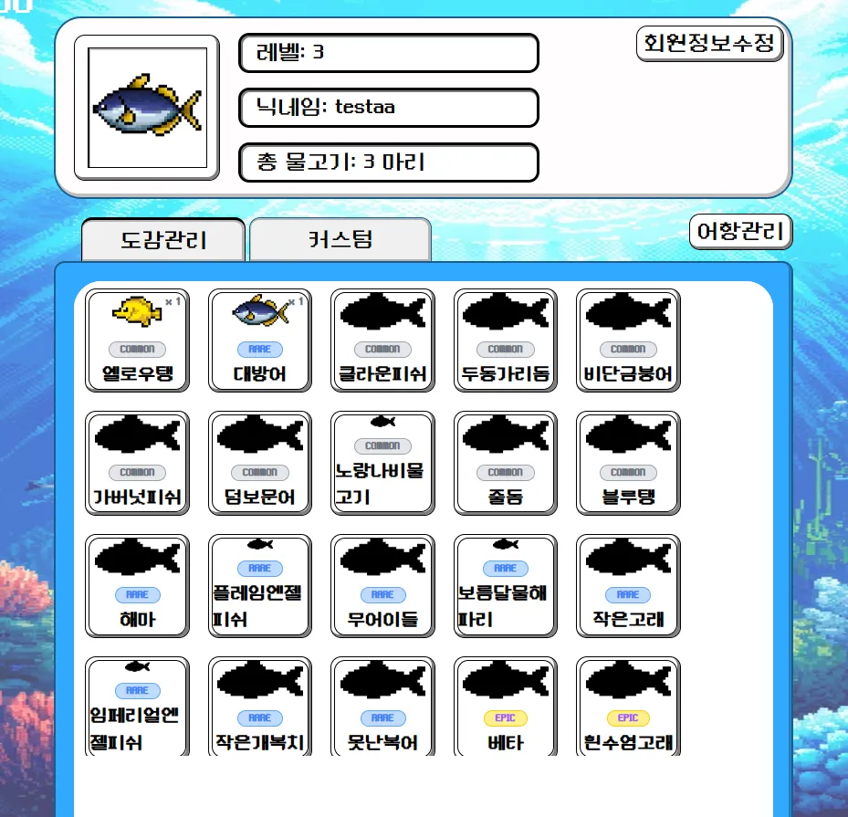
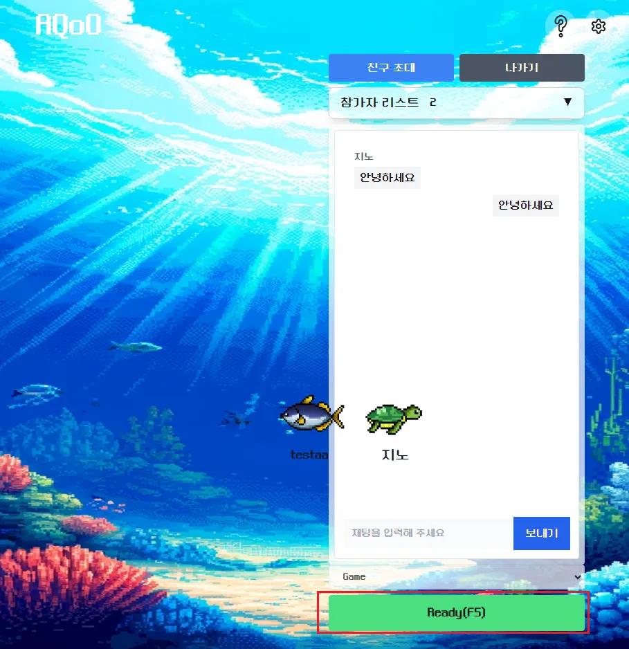

# Aqoo

> **나만의 어항에서 물고기를 키우며 ‘물멍’으로 힐링하는 Web · Mobile 서비스**

---

## 1. 서비스 소개
- **가상 어항 시뮬레이션**으로 물고기·수초를 키우고, 물 주기·청소·먹이주기를 통해 어항을 관리합니다.
- Web / PWA / Electron(데스크톱) 3종 빌드를 제공하여 언제 어디서든 ‘물멍’ 가능!
- 실시간 WebSocket으로 친구의 어항을 구경하고, Firebase WebPush로 이벤트 알림을 받습니다.

---

## 2. 팀원 소개
| 이름 | 역할 | 주요 담당 모듈 | GitHub |
|------|------|----------------|--------|
| 김OO | **PM / FE** | UI/UX · 상태관리 | [@kim](https://github.com/kim) |
| 이OO | **BE Lead** | API · DB · Security | [@lee](https://github.com/lee) |
| 박OO | **DevOps** | CI/CD · 인프라 | [@park](https://github.com/park) |
| 최OO | **3D & Motion** | GSAP · Mediapipe | [@choi](https://github.com/choi) |

> 📌 6 명 팀 프로젝트 중 예시 4 명 표기. 실제 인원에 맞게 수정하세요.

---

## 3. 기술 스택
### 3‑1. Frontend
[](https://nextjs.org)
[](https://www.typescriptlang.org)
[](https://tailwindcss.com)
[](https://recoiljs.org)
[](https://axios-http.com)
[]()
[]()

### 3‑2. Backend
[](https://spring.io)
[](https://openjdk.org)
[]()
[]()
[]()
[]()
[]()
[]()
[]()

### 3‑3. DB
[](https://mysql.com)

### 3‑4. Infra & DevOps
[](https://docker.com)
[](https://jenkins.io)
[](https://nginx.org)
[](https://aws.amazon.com/ec2)
[](https://certbot.eff.org)

Citations:

[1] https://img.shields.io/badge/Next.js-000?logo=next.js&logoColor=white

[2] https://nextjs.org

[3] https://img.shields.io/badge/TypeScript-3178C6?logo=typescript&logoColor=white

---

## 4. 주요 기능
1. **어항 시뮬레이션** : 물고기·수초 추가, 성장 애니메이션, 수질 관리(먹이·청소·물갈이 주기).
2. **실시간 상호작용** : WebSocket(STOMP) 기반 친구 어항 방문 & 채팅.
3. **멀티 플랫폼** : Web(PWA) + Electron 데스크톱 패키지 자동 배포.
4. **OAuth2 소셜 로그인** : Google, Naver 지원 + JWT 세션 유지.
5. **푸시 알림** : Firebase Cloud Messaging으로 어항 이벤트 알림.
6. **이미지 CDN** : `/images` 경로로 정적 리소스 서빙 (Nginx Alias).

---

## 5. 배포 특이사항
- **정적 이미지**는 EC2 `/home/ubuntu/images` 외부 볼륨에 두고, Nginx `alias`로 노출합니다.
- **환경 변수**는 `.env` 로 관리하며, Jenkins에서 Build‑time Secret 으로 주입합니다.
- **Nginx Reverse Proxy** : 443 → Next.js :3000 / Spring API :8089 / WebSocket :8089.
- **CI/CD** : Jenkins Pipeline이 프론트·백엔드 Docker 이미지를 빌드 후 `docker compose up -d` 로 롤링 업데이트.

---

## 6. ERD


---

## 7. 시스템 아키텍처
```
Browser / Electron ↔ Nginx(SSL) ↔ ① Next.js (SSR)  ↔  Redis (세션)
                               ↔ ② Spring Boot API ↔  MySQL 8.0
                               ↔ ③ WebSocket Hub  ↔  Firebase FCM
```
- **1** : 프론트 서버‑사이드 렌더링 & 정적 자산 제공
- **2** : 비즈니스 로직, OAuth2, JWT, JPA
- **3** : STOMP 메시지 브로커 (Spring WebSocket)

---

## 미리보기






### 이미지 폴더 위치
`exec/images` → **컨테이너 외부** `/home/ubuntu/images` (심볼릭 링크 권장)

---

> © 2025 Aqoo Team – MIT License

