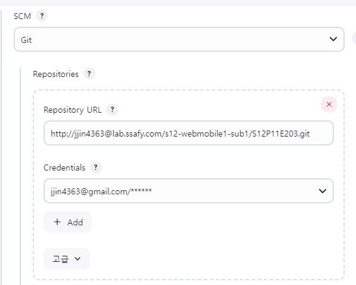

# Aqoo 서비스 포팅 매뉴얼

### 이미지 폴더
- images 폴더가 /home/ubuntu 에 위치 해있어야 합니다.


### Frontend 테스트 명령어

- 개발 서버 실행 : 로컬 개발 환경에서 Next.js 개발 서버를 실행합니다.
    
    ```bash
    npm run dev
    ```
    
- 프로덕션 빌드 및 실행 :
    
    ```bash
    npm run build
    npm run start
    ```
    
- (필요 시) Electron 환경 테스트:
    
    ```bash
    npm run electron:dev     # 개발 모드 실행
    npm run electron:build   # 빌드 후 실행 파일 생성
    ```
    

---

### Backend 테스트 명령어

- 서버 실행 (개발 모드)
    
    ```bash
    ./gradlew bootRun
    또는
    gradle bootRun
    ```
    
- 프로덕션 빌드
    
    ```bash
    ./gradlew build
    또는
    gradle build
    ```
    

---

### DB 덤프적용

```sql
CREATE DATABASE aqoo;

mysql -u root -p aqoo; < aqoodump.sql
```

---

## 1. 사용 도구

- **이슈 관리:** JIRA
- **형상 관리:** GitLab
- **커뮤니케이션:** Mattermost, Notion
- **디자인:** Figma
- **UCC:** Movavi
- **CI/CD:** Docker, Jenkins

## 2. 개발 환경

- **서버 OS:** Ubuntu 22.04
- **IDE:** VS Code, IntelliJ
- **SSH 접속:** MobaXterm
- **DB:** MySQL 8.0.4
- **Front-end:**
    - **Node.js:** 22.13
    - **TypeScript**
- **Back-end:**
    - **JVM:** 17
    - **빌드 도구:** Gradle

## 3. DB

### 3.1 접속 정보

- **스키마명:** aqoo
- **사용자:** ssafy
- **비밀번호:** ssafy

### 3.2 ERD


## 4. 시스템 아키텍처 및 기술 스택

### 4.1 프론트엔드

- **주요 기술:** Next.js, TypeScript, HTML5, JavaScript
- **상태 관리:** Context API, Recoil
- **API 통신:** Axios
- **웹소켓 통신:** stompjs, sockjs
- **스타일링:** Tailwind CSS, Styled Components

### 4.2 백엔드

- **주요 기술:** Spring Boot (3.4.1), Spring Security, OAuth2
- **인증 및 토큰 관리:** JWT, Google Auth, Naver API, Firebase, WebPush
- **웹소켓:** stompjs
- **ORM:** JPA

## 5. 서버설정

- **백엔드** 설정 **application.properties**
    
    ```jsx
    spring.application.name=aqoo
    
    # ================================
    # =         DataSource           =
    # ================================
    spring.datasource.url=jdbc:mysql://localhost:3306/aqoo?characterEncoding=UTF-8&serverTimezone=UTC
    spring.datasource.driver-class-name=com.mysql.cj.jdbc.Driver
    spring.datasource.username=${DB_ID}         # {DB_ID} 변수 처리
    spring.datasource.password=${DB_PW}           # {DB_PW} 변수 처리
    
    # ================================
    # =       JPA / Hibernate        =
    # ================================
    spring.jpa.hibernate.ddl-auto=${JPA_AUTO_OPTION}
    spring.jpa.show-sql=false
    
    # ================================
    # =       OAuth2 - Google        =
    # ================================
    spring.security.oauth2.client.registration.google.client-id=${GOOGLE_CLIENT_ID}         # {GOOGLE_CLIENT_ID} 변수 처리
    spring.security.oauth2.client.registration.google.client-secret=${GOOGLE_CLIENT_SECRET}     # {GOOGLE_CLIENT_SECRET} 변수 처리
    spring.security.oauth2.client.registration.google.redirect-uri={백엔드도메인}/login/oauth2/code/google
    spring.security.oauth2.client.registration.google.scope=profile,email
    
    # ================================
    # =        OAuth2 - Naver        =
    # ================================
    spring.security.oauth2.client.registration.naver.client-id=${NAVER_CLIENT_ID}           # {NAVER_CLIENT_ID} 변수 처리
    spring.security.oauth2.client.registration.naver.client-secret=${NAVER_CLIENT_SECRET}       # {NAVER_CLIENT_SECRET} 변수 처리
    spring.security.oauth2.client.registration.naver.redirect-uri={백엔드도메인}/login/oauth2/code/naver
    spring.security.oauth2.client.registration.naver.authorization-grant-type=authorization_code
    spring.security.oauth2.client.registration.naver.scope=name,email
    spring.security.oauth2.client.registration.naver.client-name=naver
    
    spring.security.oauth2.client.provider.naver.authorization-uri=https://nid.naver.com/oauth2.0/authorize
    spring.security.oauth2.client.provider.naver.token-uri=https://nid.naver.com/oauth2.0/token
    spring.security.oauth2.client.provider.naver.user-info-uri=https://openapi.naver.com/v1/nid/me
    spring.security.oauth2.client.provider.naver.user-name-attribute=response
    
    server.port=8089
    server.url=https://{이미지서버도메인}/images
    
    # ================================
    # =          Mail Send         =
    # ================================
    spring.mail.host=smtp.gmail.com
    spring.mail.port=587
    spring.mail.username=${MAIL_ID}           # {MAIL_ID} 변수 처리
    spring.mail.password=${MAIL_PW}           # {MAIL_PW} 변수 처리
    spring.mail.properties.mail.smtp.auth=true
    spring.mail.properties.mail.smtp.starttls.enable=true
    spring.mail.transport.protocol=smtp
    spring.mail.debug=true
    spring.mail.default.encoding=UTF-8
    
    logging.level.org.hibernate=ERROR
    logging.level.org.hibernate.SQL=OFF
    logging.level.org.hibernate.type.descriptor.sql=OFF
    logging.level.org.com.aqoo.domain.game.service.GameService=ERROR
    
    game.feed-interval=30
    game.clean-interval=120
    game.water-interval=240
    
    ```
    
- **프론트 엔드 package.json**
    
    ```json
    {
      "name": "aqoo-fe",
      "version": "0.1.0",
      "private": true,
      "scripts": {
        "dev": "next dev",
        "build": "next build",
        "start": "next start",
        "electron:dev": "electron .",
        "electron:build": "electron-builder",
        "lint": "next lint --quiet"
      },
      "dependencies": {
        "@mediapipe/camera_utils": "^0.3.1675466862",
        "@mediapipe/drawing_utils": "^0.3.1675466124",
        "@mediapipe/hands": "^0.4.1675469240",
        "@stomp/stompjs": "^7.0.0",
        "axios": "^1.7.9",
        "firebase": "^11.3.0",
        "gsap": "^3.12.7",
        "howler": "^2.2.4",
        "i": "^0.3.7",
        "lucide-react": "^0.474.0",
        "next": "14.2.23",
        "next-pwa": "^5.6.0",
        "react": "^18",
        "react-dom": "^18",
        "react-hook-form": "^7.50.1",
        "react-icons": "^5.4.0",
        "react-query": "^3.39.3",
        "react-toastify": "^11.0.3",
        "react-transition-group": "^4.4.5",
        "react-webcam": "^7.2.0",
        "recoil": "^0.7.7",
        "recoil-persist": "^5.1.0",
        "sockjs-client": "^1.6.1",
        "styled-components": "^6.1.14",
        "tailwind-scrollbar-hide": "^2.0.0"
      },
      "devDependencies": {
        "@tanstack/react-query": "^5.66.0",
        "@types/howler": "^2.2.12",
        "@types/lodash": "^4.17.15",
        "@types/node": "^20",
        "@types/react": "^18",
        "@types/react-dom": "^18",
        "@types/sockjs-client": "^1.5.4",
        "@types/styled-components": "^5.1.34",
        "autoprefixer": "^10.4.20",
        "electron": "^34.2.0",
        "electron-builder": "^25.1.8",
        "eslint": "^8",
        "eslint-config-next": "14.2.23",
        "postcss": "^8.5.1",
        "tailwindcss": "^3.4.17",
        "typescript": "^5"
      }
    }
    
    ```
    
    ### 5.3 서버(EC2) – nginx 설정 (nginx.conf)
    
    ```bash
    sudo vim /etc/nginx/sites-enabled/default
    ```
    
    ### HTTP (80) – HTTP 요청을 HTTPS로 리다이렉트
    
    ```bash
    sudo vim /etc/nginx/sites-enabled/default
    
    #############################################
    # HTTP (80) - HTTPS로 리다이렉트
    #############################################
    server {
        listen 80;
        listen [::]:80;
        server_name {도메인주소};
    
        location /images/ {
            root /home/ubuntu/images/;
            autoindex on;
        }
    
        # 모든 HTTP 요청을 HTTPS로 리다이렉트
        return 301 https://$host$request_uri;
    }
    
    #############################################
    # HTTPS (443) - SSL 적용 후 컨테이너(포트 80)로 reverse proxy
    #############################################
    server {
        listen 443 ssl;
        listen [::]:443 ssl;
        server_name {도메인주소};
    
        ssl_certificate     /etc/letsencrypt/live/{도메인주소}/fullchain.pem;
        ssl_certificate_key /etc/letsencrypt/live/{도메인주소}/privkey.pem;
        include             /etc/letsencrypt/options-ssl-nginx.conf;
        ssl_dhparam         /etc/letsencrypt/ssl-dhparams.pem;
    
        location / {
            proxy_pass http://127.0.0.1:3000;
            proxy_http_version 1.1;
            proxy_set_header Upgrade $http_upgrade;
            proxy_set_header Connection "upgrade";
            proxy_set_header Host $host;
            proxy_cache_bypass $http_upgrade;
        }
    
        # 백엔드 API (예: /api/ 로 시작하는 요청)
        location /api/ {
            proxy_pass http://127.0.0.1:8089;
            proxy_set_header Host $host;
            proxy_set_header X-Real-IP $remote_addr;
            proxy_set_header X-Forwarded-For $proxy_add_x_forwarded_for;
        }
    
        # OAuth2 및 웹소켓 관련 경로 프록시
        location /login/oauth2/ {
            proxy_pass http://127.0.0.1:8089;
            proxy_set_header Host $host;
            proxy_set_header X-Real-IP $remote_addr;
            proxy_set_header X-Forwarded-For $proxy_add_x_forwarded_for;
        }
        location /oauth2/ {
            proxy_pass http://127.0.0.1:8089;
            proxy_set_header Host $host;
            proxy_set_header X-Real-IP $remote_addr;
            proxy_set_header X-Forwarded-For $proxy_add_x_forwarded_for;
        }
        location /ws/ {
            proxy_pass http://127.0.0.1:8089;
            proxy_set_header Host $host;
            proxy_set_header X-Real-IP $remote_addr;
            proxy_set_header X-Forwarded-For $proxy_add_x_forwarded_for;
        }
    
        location /images/ {
            alias /home/ubuntu/images/;
            autoindex on;
        }
    
        location /downloads/ {
            alias /var/www/html/downloads/;
            autoindex on;
            # 파일 다운로드 시 지정된 이름으로 다운로드
            add_header Content-Disposition 'attachment; filename="AQoO_Installer.exe"';
        }
    }
    
    ```
    
    ### HTTPS 적용 (Certbot)
    
    ```bash
    sudo apt update
    sudo apt install certbot python3-certbot-nginx
    sudo certbot --nginx -d {도메인주소}
    
    ```
    

## 6. 빌드 및 배포

### 6.1젠킨스 컨테이너 실행

```bash
docker run -d \
-p 8080:8080 -p 50000:50000 \
-v jenkins_home:/var/jenkins_home \
-v /var/run/docker.sock:/var/run/docker.sock \
--group-add $(stat -c '%g' /var/run/docker.sock) \
-e JENKINS_REMEMBER_ME_COOKIE_KEY=$(openssl rand -hex 32) \
--name jenkins jenkins/jenkins:lts
```

- EC2 주소:8080 젠킨스 접속

**파이프라인 구성:**

- GitLab 플러그인 설치
- Jenkinsfile, Dockerfile 설정
- Git 저장소 URL 입력 시: `https://{깃랩아이디}@{저장소주소}.git`
    - 계정 액세스 토큰 사용
    - 브랜치 및 Jenkinsfile 위치 설정
- GitLab 프로젝트 액세스 토큰 생성 후 젠킨스의 GitLab API 토큰으로 사용
- 파이프라인 구성 시 Build 트리거 설정
- 참고: [Jenkins + GitLab 연동 및 Webhook 설정](https://velog.io/@suhongkim98/jenkins-gitlab-%EC%97%B0%EB%8F%99-%EB%B0%8F-webhook-%EC%84%A4%EC%A0%95%ED%95%98%EA%B8%B0)
    
    
    
    
    
    
    
- 웹훅 참고 사이트
    
    [https://velog.io/@suhongkim98/jenkins-gitlab-%EC%97%B0%EB%8F%99-%EB%B0%8F-webhook-%EC%84%A4%EC%A0%95%ED%95%98%EA%B8%B0](https://velog.io/@suhongkim98/jenkins-gitlab-%EC%97%B0%EB%8F%99-%EB%B0%8F-webhook-%EC%84%A4%EC%A0%95%ED%95%98%EA%B8%B0)
    
- 환경변수 파일( .env)
    
    ```bash
    DB_ID={DB_ID}
    DB_PW={DB_PW}
    JPA_AUTO_OPTION=none
    GOOGLE_CLIENT_ID={GOOGLE_CLIENT_ID}
    GOOGLE_CLIENT_SECRET={GOOGLE_CLIENT_SECRET}
    NAVER_CLIENT_ID={NAVER_CLIENT_ID}
    NAVER_CLIENT_SECRET={NAVER_CLIENT_SECRET}
    MAIL_ID={MAIL_ID}
    MAIL_PW={MAIL_PW}
    ```
    

### 6.3 빌드 (Dockerfile)

- frontend/Dockerfile
    - 같은 위치에 nginx.conf파일 존재(frontend 컨테이너 전용, EC2 서버의 nginx설정 X)

```bash
server {
    listen 80;
    server_name {서버_IP또는도메인};

    # Next.js 프론트엔드 HTML 처리용 리버스 프록시
    location / {
        proxy_pass http://localhost:3000;
        proxy_http_version 1.1;
        proxy_set_header Upgrade $http_upgrade;
        proxy_set_header Connection "upgrade";
        proxy_set_header Host $host;
        proxy_cache_bypass $http_upgrade;
    }

    # 백엔드 API 요청 처리용 리버스 프록시
    location /api/ {
        proxy_pass http://localhost:8089;
        proxy_http_version 1.1;
        proxy_set_header Upgrade $http_upgrade;
        proxy_set_header Connection "upgrade";
        proxy_set_header Host $host;
        proxy_cache_bypass $http_upgrade;
    }

    # 정적 파일 캐시 설정
    location ~* \.(?:css|js|woff2|eot|ttf|svg|ico|jpg|jpeg|png|gif|webp|json|xml)$ {
        expires 30d;
        add_header Cache-Control "public, no-transform";
    }

    # 에러 페이지 설정 (필요 시)
    error_page 404 /404.html;
    location = /404.html {
        root /usr/share/nginx/html;
    }
}
```

### Backend

- backend/Dockerfile

### 6.4 배포

- forntend ,backend 모두 Jenkinsfile 에서 docker 명령어로 배포됨
- CI/CD 파이프라인에 필요한 환경 변수 파일은 위 .env 파일을 사용
- CI/CD - 젠킨스 사용
    - 젠킨스 파일 위치
        - frotnend/Jenkinsfile
        - backend/Jenkinsfile
    - CI/CD에 필요 환경 변수 파일은 위와 같음